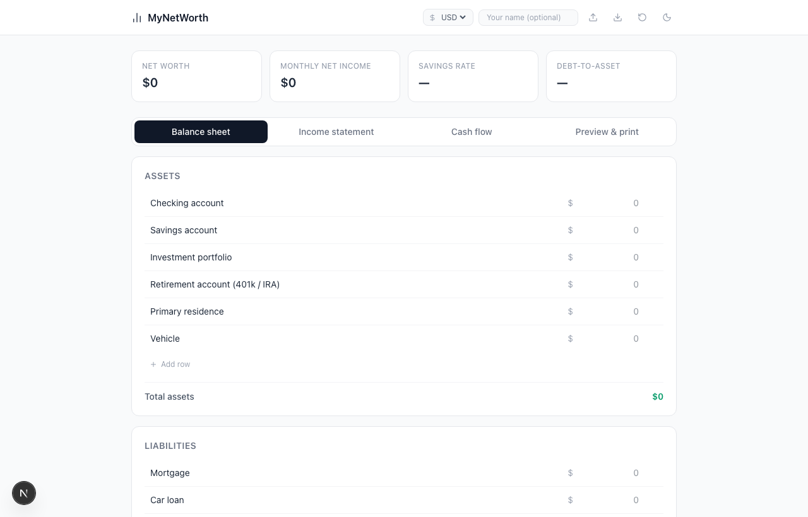

# MyNetWorth

A personal financial statement builder — balance sheet, income statement, and cash flow in one place. No signup, no backend, data stays in your browser.



## Features

- **Balance sheet** — assets, liabilities, and net worth
- **Income statement** — monthly income, expenses, net income, and savings rate
- **Cash flow** — one-off inflows and outflows
- **Summary dashboard** — key metrics always visible at the top
- **PDF export** — clean, B&W-friendly print view via `window.print()`
- **Multi-currency** — USD, EUR, GBP, INR
- **Dark mode** — persisted alongside your data
- **JSON backup** — export and import your data

## Tech stack

- [Next.js 16](https://nextjs.org) (App Router, TypeScript)
- [Tailwind CSS v4](https://tailwindcss.com)
- [lucide-react](https://lucide.dev) icons
- `localStorage` for persistence — no backend required

## Local development

```bash
# Install dependencies
pnpm install

# Start dev server
pnpm dev
```

Open [http://localhost:3000](http://localhost:3000).

## Deployment

### Vercel (recommended)

[](https://vercel.com/new)

1. Push this repo to GitHub
2. Import it in [Vercel](https://vercel.com)
3. Set the custom domain to `mynetworth.nishan-shetty.com`
4. Deploy — no environment variables needed

### Manual

```bash
pnpm build
pnpm start
```

## License

MIT

---

Built by [Nishan Shetty](https://nishan-shetty.com)
